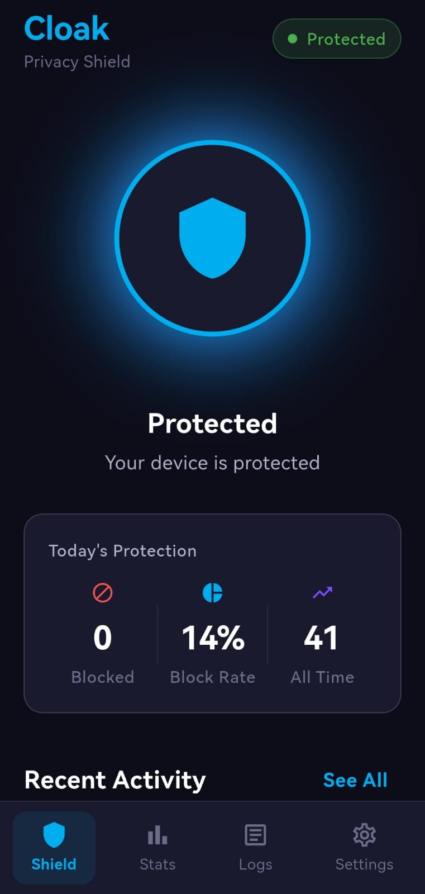
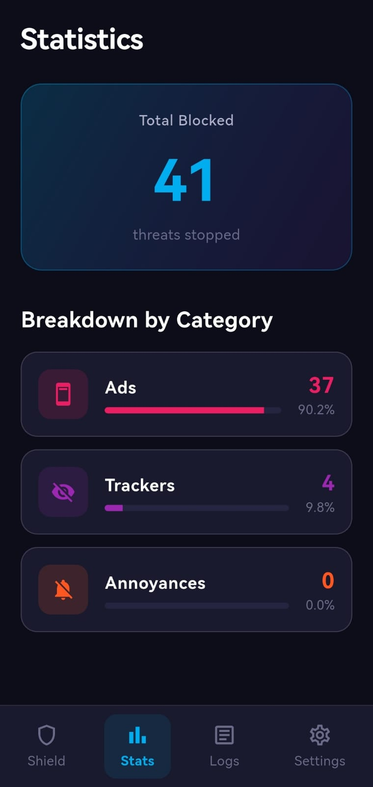
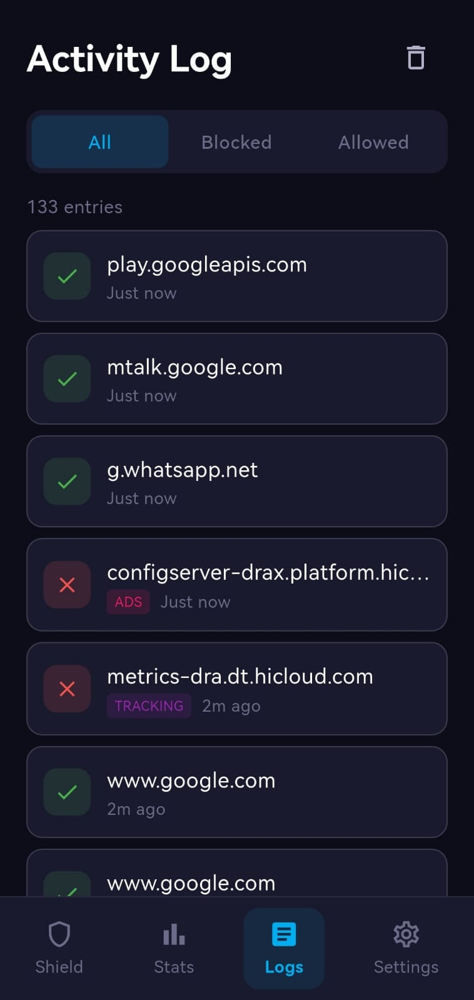
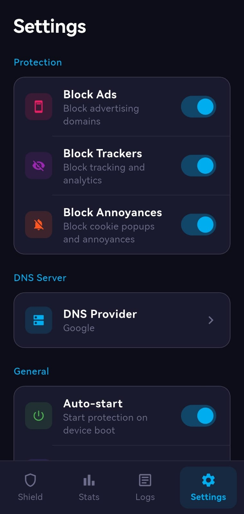

# 🛡️ Cloak

**System-wide ad and tracker blocker for Android** using VPN-based DNS filtering. Block ads, trackers, and annoyances across all apps with a single tap.

[](https://github.com/shershahx/cloak/releases)
[](LICENSE)

## 📱 Screenshots

<p align="center">
  
  
  
  
</p>

## ✨ Features

- **🚫 Block Ads** - 97,000+ ad domains blocked
- **🔒 Block Trackers** - 9,000+ tracking domains blocked  
- **🌐 System-wide Protection** - Works across ALL apps
- **⚡ Lightweight VPN** - Only DNS traffic is filtered, no speed impact
- **🎨 Beautiful UI** - Modern Material Design with dark/light themes
- **📊 Real-time Stats** - See what's being blocked live
- **📋 DNS Query Logs** - Full transparency on network activity
- **🔐 Privacy-First** - All processing on-device, zero data collection

## 📥 Download

Download the latest APK from [Releases](https://github.com/shershahx/cloak/releases/latest).

## 🔧 How It Works

Cloak creates a local VPN tunnel that intercepts DNS queries (port 53). When an app tries to resolve a domain:

1. **Whitelisted?** → Allow (essential services like YouTube, Google, etc.)
2. **In Blocklist?** → Block (return 0.0.0.0)
3. **Neither?** → Forward to upstream DNS (Cloudflare, Google, etc.)

```
App → DNS Query → Cloak VPN → Check Lists → Allow/Block
```

**Important:** This is NOT a traditional VPN. Your traffic doesn't go through remote servers - everything is processed locally on your device.

## 🛠️ Tech Stack

- **Frontend:** Flutter 3.10.1 + Riverpod
- **Backend:** Kotlin VPN Service
- **DNS Parsing:** Custom UDP packet parser
- **Blocklist:** 106,964 domains from Ghostery/EasyList

## 🏗️ Building from Source

### Prerequisites
- Flutter 3.10.1+
- Android Studio / VS Code
- Android SDK 21+

### Steps

```bash
# Clone the repository
git clone https://github.com/shershahx/cloak.git
cd cloak

# Get dependencies
flutter pub get

# Build debug APK
flutter build apk --debug

# Build release APK
flutter build apk --release
```

## 📊 Blocklist Sources

Domains are derived from:
- [Ghostery Extension](https://github.com/nicholashess/ghostery-extension)
- EasyList / EasyPrivacy
- Fanboy's Annoyances

## 🔐 Security & Privacy

See [SECURITY.md](SECURITY.md) for our complete security policy.

**TL;DR:**
- ✅ All processing on-device
- ✅ No data collection
- ✅ No remote servers
- ✅ No analytics/telemetry
- ✅ Open source

## 📄 License

This project is licensed under the MIT License - see the [LICENSE](LICENSE) file for details.

## 🙏 Acknowledgments

- [Ghostery](https://www.ghostery.com/) - Blocklist source
- [EasyList](https://easylist.to/) - Community blocklists
- [Flutter](https://flutter.dev/) - UI framework

---

<p align="center">
  Made with ❤️ for a cleaner, faster, more private internet
</p>
